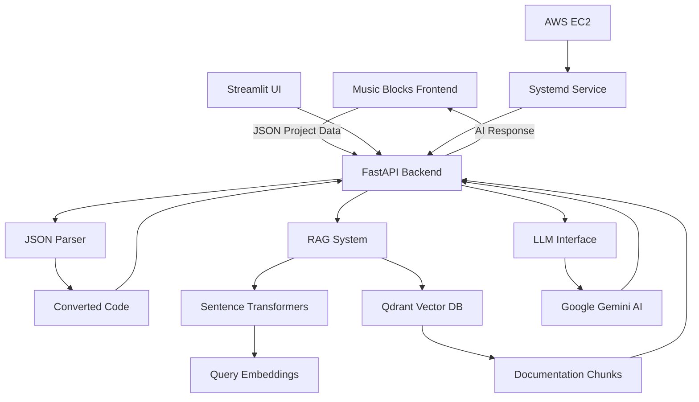

# 🎵 AI-Powered Debugger for Music Blocks

## Sugar Labs Google Summer of Code 2025

### 🚀 Help Shape the Future of Music Education

Music Blocks is an advanced platform that makes learning programming through music fun and accessible. This AI-powered debugger takes it to the next level by providing intelligent, kid-friendly assistance to young learners as they create their musical projects. **We welcome passionate contributors to join us in revolutionizing music education through AI.**

---

## 📋 Table of Contents

- [🎯 Project Overview](#project-overview)
- [🏗️ Architecture](#architecture)
- [💻 Tech Stack](#tech-stack)
- [🔧 Components](#components)
- [⚡ Quick Start](#quick-start)
- [☁️ AWS EC2 Deployment](#aws-ec2-deployment)
- [🛠️ Development Setup](#development-setup)
- [📁 Project Structure](#project-structure)
- [📡 API Documentation](#api-documentation)
- [🤝 Contributing](#contributing)
- [📚 Additional Resources](#additional-resources)

---

## 🎯 Project Overview

The AI-Powered Music Blocks Debugger is an intelligent assistant designed to help children debug their Music Blocks projects. It combines the power of modern AI with educational pedagogy to provide:

- **Kid-friendly explanations** of coding errors and music theory concepts
- **Interactive debugging sessions** that encourage learning through play
- **Context-aware suggestions** based on Music Blocks documentation and examples
- **Real-time analysis** of Music Blocks project JSON code

### What Makes It Special

- **Educational Focus**: Designed specifically for young learners with simple language and engaging interactions
- **Music-Centric**: Understands both programming logic and musical concepts
- **Interactive Learning**: Asks questions and provides choices to keep kids engaged
- **Comprehensive Support**: Covers melody, rhythm, loops, instruments, and mathematical music patterns

---

## 🏗️ Architecture



### Data Flow

1. **Input Processing**: Music Blocks project JSON is received via FastAPI endpoint
2. **Code Conversion**: JSON is parsed and converted to human-readable format
3. **Context Retrieval**: Relevant documentation is fetched using RAG (Retrieval Augmented Generation)
4. **AI Analysis**: Google Gemini analyzes the code with retrieved context
5. **Response Generation**: Kid-friendly debugging advice is generated and returned

---

## 💻 Tech Stack

### Backend Core
- **[FastAPI](https://fastapi.tiangolo.com/)** - Modern, fast web framework for APIs
- **[Python 3.8+](https://python.org/)** - Primary programming language
- **[Uvicorn](https://www.uvicorn.org/)** - ASGI server for production deployment

### AI & Machine Learning
- **[Google Gemini 1.5 Flash](https://ai.google.dev/)** - Large Language Model for intelligent responses
- **[Sentence Transformers](https://www.sbert.net/)** - Text embeddings for semantic search
- **[Qdrant](https://qdrant.tech/)** - Vector database for document retrieval

### Data Processing
- **[JSON Parser](./JSONParser/)** - Custom Music Blocks project parser
- **[Python-dotenv](https://pypi.org/project/python-dotenv/)** - Environment variable management
- **[Requests](https://docs.python-requests.org/)** - HTTP library for API calls

### Frontend Options
- **[Streamlit](https://streamlit.io/)** - Quick prototyping and demo interface
- **Direct API Integration** - For Music Blocks web application

### Infrastructure
- **[AWS EC2](https://aws.amazon.com/ec2/)** - Cloud hosting and deployment
- **[Systemd](https://systemd.io/)** - Service management for persistent deployment
- **[CORS](https://developer.mozilla.org/en-US/docs/Web/HTTP/CORS)** - Cross-origin resource sharing support

---

## 🔧 Components

### Core Modules

#### 1. **API Layer** (`app/api.py`)
- FastAPI application with CORS support
- Single `/analyze` endpoint for processing requests
- Comprehensive error handling and logging
- Environment variable configuration

#### 2. **JSON Parser** (`JSONParser/json_parser.py`)
- Converts Music Blocks JSON projects to readable code
- Handles various block types (notes, rhythms, loops, etc.)
- Extracts musical and programming logic
- **539 lines** of comprehensive parsing logic

#### 3. **RAG Retriever** (`retriever/retrieve.py`)
- Semantic search using Sentence Transformers
- Qdrant vector database integration
- Context-aware document retrieval
- Configurable similarity search

#### 4. **LLM Interface** (`llm/gemini.py`)
- Google Gemini API integration
- Retry logic for reliability
- Dual configuration support (Streamlit + standalone)
- Intelligent prompt engineering

#### 5. **Embeddings System** (`embeddings/`)
- Document ingestion and processing
- Vector embedding generation
- Database population scripts
- Configuration management

### Data Resources

#### Documentation Library (`data/docs/`)
Music Blocks examples and guides:
- **Educational Projects**: Chopsticks, Hot Cross Buns, Silent Night
- **Programming Concepts**: Loops, variables, functions
- **Music Theory**: Scales, intervals, harmonics
- **Advanced Topics**: 5 EDO, ensemble blocks, musical mastermind

#### Lesson Plans (`data/lesson plans/`)
Structured educational content:
- Building scales with programming
- Rhythm and geometry connections
- Harmonic series exploration
- Interactive learning activities

---

## ⚡ Quick Start

### Prerequisites

```bash
# Python 3.8 or higher
python --version

# Virtual environment (recommended)
python -m venv venv
source venv/bin/activate  # Linux/Mac
# or
venv\Scripts\activate  # Windows
```

### Installation

```bash
# Clone the repository
git clone https://github.com/omsuneri/AI-powered-Debugger-for-Music-Blocks.git
cd AI-powered-Debugger-for-Music-Blocks

# Install dependencies
pip install -r requirements.txt
```

### Environment Setup

Create a `.env` file in the project root:

```env
GEMINI_API_KEY=your_gemini_api_key_here
QDRANT_API_KEY=your_qdrant_api_key_here
QDRANT_URL=your_qdrant_cluster_url_here
```

### Running the Application

#### Option 1: Standalone FastAPI Server
```bash
# Run from project root
python -m app.api

# Or using uvicorn directly
uvicorn app.api:app --host 0.0.0.0 --port 8000
```

#### Option 2: Streamlit Development Interface
```bash
streamlit run app/main.py
```

The API will be available at `http://localhost:8000`

---

## ☁️ AWS EC2 Deployment

### Production Setup

Our production deployment uses AWS EC2 with systemd for persistent service management:

#### 1. **EC2 Instance Configuration**
```bash
# Connect to your EC2 instance
ssh -i your-key.pem ubuntu@your-ec2-ip

# Update system
sudo apt update && sudo apt upgrade -y

# Install Python and dependencies
sudo apt install python3 python3-pip python3-venv -y
```

#### 2. **Project Deployment**
```bash
# Clone the repository
git clone https://github.com/omsuneri/AI-powered-Debugger-for-Music-Blocks.git
cd AI-powered-Debugger-for-Music-Blocks

# Create virtual environment
python3 -m venv venv
source venv/bin/activate

# Install dependencies
pip install -r requirements.txt
```

#### 3. **Environment Configuration**
```bash
# Create .env file with your API keys
nano .env
```

#### 4. **Persistent Deployment with Systemd**
```bash
# Create systemd service file
sudo vim /etc/systemd/system/debugger.service
```

Add the following service configuration:

```ini
[Unit]
Description=Debugger for Music Blocks - FastAPI backend
After=network.target

[Service]
User=ubuntu
WorkingDirectory=/home/ubuntu/AI-powered-Debugger-for-Music-Blocks
ExecStart=/home/ubuntu/AI-powered-Debugger-for-Music-Blocks/venv/bin/python -m uvicorn app.api:app --host 0.0.0.0 --port 8000
Restart=always
RestartSec=5
Environment=PYTHONUNBUFFERED=1

[Install]
WantedBy=multi-user.target
```

#### 5. **Managing the Service**
```bash
# Reload systemd and enable the service
sudo systemctl daemon-reload
sudo systemctl enable debugger.service
sudo systemctl start debugger.service

# Check service status
sudo systemctl status debugger.service

# View real-time logs
journalctl -u debugger.service -f

# Stop/restart the service
sudo systemctl stop debugger.service
sudo systemctl restart debugger.service

# Check if server is running
curl http://localhost:8000/docs
```

### Security Configuration

#### EC2 Security Group Rules:
- **HTTP (80)**: 0.0.0.0/0
- **HTTPS (443)**: 0.0.0.0/0  
- **Custom TCP (8000)**: 0.0.0.0/0
- **SSH (22)**: Your IP only

#### Production Considerations:
- Use environment variables for sensitive data
- Enable HTTPS with SSL certificates
- Implement proper logging and monitoring
- Set up automated backups
- Configure firewall rules

---

## 🛠️ Development Setup

### Local Development Workflow

```bash
# Start development environment
source venv/bin/activate

# Run with auto-reload
uvicorn app.api:app --reload --host 0.0.0.0 --port 8000

# Test the API
curl -X POST http://localhost:8000/analyze \
  -H "Content-Type: application/json" \
  -d '{
    "code": {"your": "music_blocks_json"},
    "prompt": "Help me debug my melody"
  }'
```

### Testing

```bash
# Install testing dependencies
pip install pytest pytest-asyncio httpx

# Run tests
pytest tests/

# Test specific component
python -m pytest tests/test_api.py -v
```

### Data Management

```bash
# Populate vector database
python embeddings/injest.py

# Update documentation embeddings
python -m embeddings.injest --update
```

---

## 📁 Project Structure

```
AI-powered-Debugger-for-Music-Blocks/
├── app/
│   ├── __init__.py
│   ├── api.py              # FastAPI application
│   └── main.py             # Streamlit interface
├── llm/
│   ├── __init__.py
│   └── gemini.py           # Google Gemini integration
├── retriever/
│   ├── __init__.py
│   └── retrieve.py         # RAG document retrieval
├── JSONParser/
│   ├── __init__.py
│   └── json_parser.py      # Music Blocks JSON parser
├── embeddings/
│   ├── __init__.py
│   ├── config.py           # Configuration settings
│   └── injest.py           # Document embedding pipeline
├── data/
│   ├── docs/               # Music Blocks documentation
│   ├── guide/              # User guides
│   └── lesson plans/       # Educational content
├── Configuration Files
│   ├── requirements.txt    # Python dependencies
│   ├── .env               # Environment variables
│   └── .streamlit/
│       └── secrets.toml   # Streamlit secrets
└── README.md              # This file
```

---

## 📡 API Documentation

### Endpoints

#### `POST /analyze`

Analyzes Music Blocks projects and provides debugging assistance.

**Request Body:**
```json
{
  "code": "string | object",      // Music Blocks JSON project
  "prompt": "string",             // User's question (optional)
  "history": [                    // Chat history (optional)
    {
      "role": "user|assistant",
      "content": "string"
    }
  ],
  "prompt_count": "integer"       // Conversation turn counter
}
```

**Response:**
```json
{
  "response": "string"            // AI-generated debugging advice
}
```

**Error Response:**
```json
{
  "error": "string",              // Error message
  "details": "string"             // Detailed error information
}
```

### Configuration Options

#### Environment Variables:
- `GEMINI_API_KEY`: Google Gemini API key
- `QDRANT_API_KEY`: Qdrant vector database API key  
- `QDRANT_URL`: Qdrant cluster URL
- `PORT`: Server port (default: 8000)
- `HOST`: Server host (default: 0.0.0.0)

---

## 🤝 Contributing

### 🌟 Join the Music Blocks Revolution

Music Blocks is changing how children learn programming and music theory. Your contributions can help make this educational tool even more powerful and accessible. Whether you're passionate about education, AI, music, or programming, there's a place for you in our community.

### How to Contribute

#### 1. **Get Started**
```bash
# Fork the repository
git clone https://github.com/your-username/AI-powered-Debugger-for-Music-Blocks.git

# Create a feature branch
git checkout -b feature/amazing-new-feature

# Make your changes
# Test thoroughly
# Commit with clear messages
git commit -m "Add amazing new feature for better debugging"

# Push and create Pull Request
git push origin feature/amazing-new-feature
```

#### 2. **Areas for Contribution**

##### 🤖 AI & Machine Learning
- Improve prompt engineering for better kid-friendly responses
- Enhance context retrieval algorithms
- Add support for multiple languages
- Develop specialized models for music education

##### 🎼 Music Education
- Expand Music Blocks documentation coverage
- Create more educational examples and lesson plans
- Develop music theory explanation modules
- Add support for advanced musical concepts

##### 💻 Backend Development
- Optimize API performance and scalability
- Add comprehensive testing coverage
- Implement caching strategies
- Enhance error handling and logging

##### 🎨 Frontend Integration
- Improve Music Blocks web integration
- Create better user interfaces
- Add real-time collaboration features
- Develop mobile-friendly interfaces

##### 📖 Documentation & Education
- Write tutorials and guides
- Create video demonstrations
- Translate content to other languages
- Develop teacher resources

#### 3. **Contribution Guidelines**

##### Code Quality
- Follow PEP 8 Python style guidelines
- Write comprehensive docstrings
- Add unit tests for new features
- Ensure backward compatibility

##### Educational Focus
- Keep the target audience (children) in mind
- Use simple, clear language in all user-facing content
- Test with actual young learners when possible
- Prioritize fun and engaging interactions

##### Documentation
- Update README for significant changes
- Document new API endpoints
- Provide examples for new features
- Keep inline comments clear and helpful

### 💬 Community

- **GitHub Issues**: Report bugs and request features
- **GitHub Discussions**: Ask questions and share ideas
- **Sugar Labs Community**: Join the broader educational technology community
- **Music Blocks Forums**: Connect with educators and developers

---

## 📚 Additional Resources

### Educational Context
- **[Music Blocks Official](https://musicblocks.sugarlabs.org/)** - Main Music Blocks platform
- **[Sugar Labs](https://sugarlabs.org/)** - Educational technology organization
- **[Google Summer of Code](https://summerofcode.withgoogle.com/)** - Open source internship program

### Technical Documentation
- **[FastAPI Documentation](https://fastapi.tiangolo.com/)** - Web framework docs
- **[Google Gemini AI](https://ai.google.dev/)** - LLM API documentation  
- **[Qdrant Documentation](https://qdrant.tech/documentation/)** - Vector database docs
- **[Sentence Transformers](https://www.sbert.net/)** - Text embedding library

### Music Programming Resources
- **[Music Blocks Guide](./data/guide/README.md)** - Getting started with Music Blocks
- **[Lesson Plans](./data/lesson%20plans/)** - Educational activities and curricula
- **[Project Examples](./data/docs/)** - Sample Music Blocks projects

### Development Tools
- **[AWS EC2 Documentation](https://docs.aws.amazon.com/ec2/)** - Cloud deployment
- **[Systemd Documentation](https://systemd.io/)** - Service management
- **[Python Virtual Environments](https://docs.python.org/3/tutorial/venv.html)** - Environment management

---

## 🎉 Let's Build the Future of Music Education Together!

The intersection of AI, music, and education offers incredible opportunities to inspire the next generation of creative programmers and musical artists. Your contributions to this project help democratize music education and make programming accessible through the universal language of music.

**Every line of code, every documentation improvement, every bug fix, and every new feature brings us closer to a world where any child can express their creativity through the power of Music Blocks.**

⭐ **Star this repository** to show your support!  
🤝 **Fork and contribute** to make a difference!  
📢 **Share with others** who are passionate about education and technology!

---

**Made with ❤️ for Music Blocks and Sugar Labs**  
**Part of Google Summer of Code 2025**
